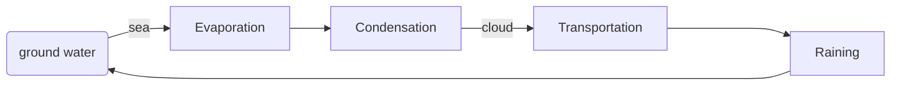
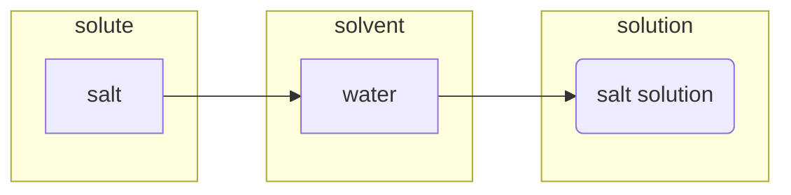
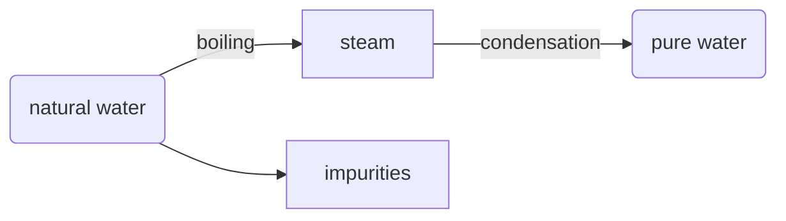
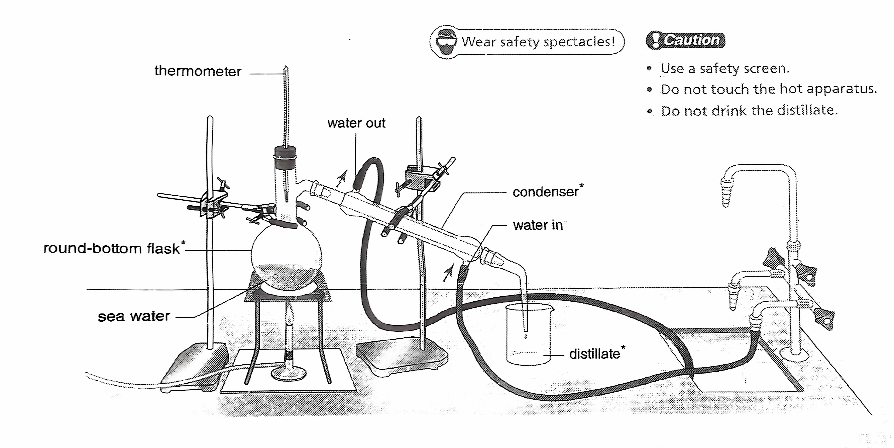
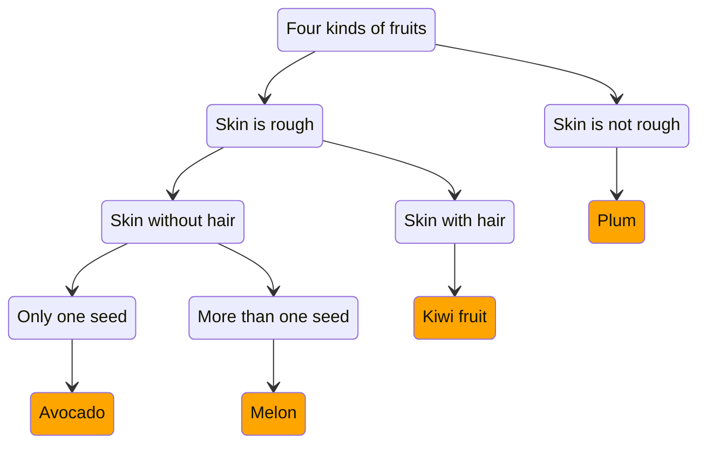
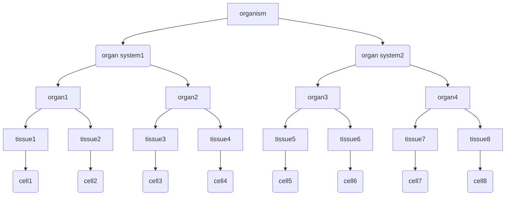
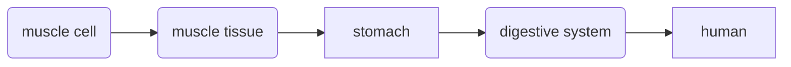
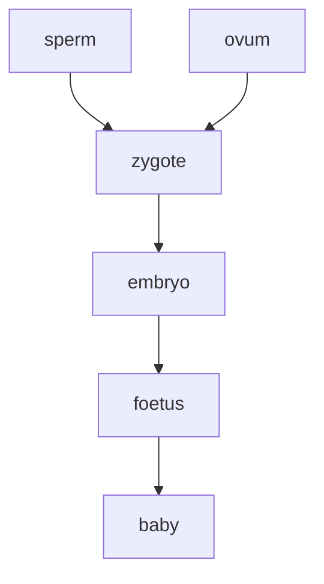

# Mastering Science
<!-- [toc] -->
## unit 2 water
Water exists on earth in three physical states. Ice is the solid state. water is the liquid state. water vapour is the gas state. 
### melting & boiling
- melting: ice turns into water at room temperature(0 ℃). 
- boiling: water turns into steam when it boils(100 ℃).
when ice melts or water boils, it **absorbs energy** from the surrounding. the temperature does not change.
### freezing
freezing: water turns into ice below the 0 ℃.
melting point = freezing point, for water both are 0 ℃.
during freezing, water **releases energy** to the surroundings, temperature does not change.
### condensation
condensation may occur at temperatures below the boling point. Energy is released when water vapour or steam cools down and turns into liquid water.
### evaporation
evaporation: water turns into vapour. It **absorbs energy** from the surrounding. Evaporation can take place below its boiling point.

### water cycle

### dissolving


- soluble: substances that can be dissolved in water.
- insoluble: substances that cannot be dissolved in water.

### factors affecting rate of dissolving
- the **temperature** of water is higher.
- the **solute pieces** are smaller in size.
- the water is **stirred**.

### water purfication
#### impurities
- insoluble
  - plant debris
  - sand
- soluble
  - mineral salt
- microorganisms
  - *E.coli*
  - Amoeba

#### method of water purification
#### sedimentation
using alum to settle down insoluble impurities.
#### filtration
using filtration column to filter out impurities.

#### distillation



#### further treatment of drinking water
**method to kill microorganisms** 

1. using chlorine
   1. kill microorganisms
   2. local water treatment and swimming pools
   3. slightly **pungent**
2. using ozone
   1. more powerful than chlorine in killing microorganisms
   2. **no pungent**
   3. no ozone is left in the water
3. using ultraviolet light
   1. kill microorganisms
4. fluoridation
   1. water undergoes fluoridation before it gives to consumers
   2. adding fluoride to drinking water can help prevent tooth decay
## unit 3 looking at living things
### seven vital functions
- living things have ways to obtain food
- living things have ways to obtain air
- living things move
- living things grow
- living things react to stimuli
- living things excrete(not egestion)
- living things reproduce

biodiversity: the wide wariety of living things.

### grouping of living things
some key features are related to the **adaptation** of the animals to their living environment(called **habitats**)

- **animals**
    - invertebrates(without backbone)
        - jellyfish
        - crab
        - insect
    - vertebrates(have a backbone)
        - fish
            - slimy scales
            - **gills**
            - **fins**
            - **body temperature changes** with the environment
      - amphibians
          - **moist skin not scales**
          - the young forms have gills, the adults breathe with **lungs** and skin
          - the adults have four limbs
          - **body temperature changes** with the environment
      - reptiles
          - have dry, hard scales
          - breathe with **lungs**
          - have four limbs
          - **body temperature changes** with the environment
      - birds
          - have **beak** and **feathers**
          - breathe with **lungs**
          - have **a pair of wings** for flying and two other limbs
          - can keep a **constant body temperature**
      - mammals
          - have mammary glands for **producing milk**
          - have fur or hair on the skin
          - breathe with **lungs**
          - have four **limbs**
          - can keep a **constant body temperature**
- **plants**
    - non-vascular plants
        - do not have **vascular tissue**
        - grow in **damp** places
        - simple stems and leaves, no root
        - example: **mosses**
    - vascular plants(**xylem** transport water, **phloem** transport food)
        - seedless plants
            - release **spores** for reproduction
        - seed plants
            - non-flowering plants
                - do not produce flower
                - their are not found in fruits, in cones
                - **pines, firs**
            - flowering plants
                - produce flower
                - seed are protected in fruits
                - **apple tree, lilies**

### identification key


```
step 1 a Skin is rough....................2
       b Skin is not rough................plum
step 2 a Skin with hair...................Kiwi fruit
       b Skin without hair................3
step 3 a Only one seed....................Avocado
       b More than one seed...............Melon
```
#### biodiversity
- biodiversity is reducing rapidly
- living things in danger of extinction are called **endangered species**

## unit 4 cells, human reproduction and heredity
### cells
- All living things are made of **cells**
    - **unicellular** organisms: Amoeba, bacteria
    - **multicellular** organisms: plants, animals
- Cells are **basic unit** of living things
- Observing cells using microscopes
    - Light microscopes
    - Electron microscopes

#### cells
| structure                                                     | plant cell | animal cell | function                              |
| ------------------------------------------------------------- | ---------- | ----------- | ------------------------------------- |
| **cell wall**                                                 | ✓          | ✕           | protect,support and give a shape      |
| cell memebrane                                                | ✓          | ✓           | controls the movement of substances   |
| cytoplasm                                                     | ✓          | ✓           | chemical reaction take place          |
| nucleus                                                       | ✓          | ✓           | contains **DNA**                      |
| **vacuole**                                                   | ✓(large)   | ✓(small)    | stores water and **minerals**         |
| <span style="color:green;font-weight:bold">chloroplast</span> | ✓          | ✕           | the site of **photosynthesis** occurs |

#### DNA in the nucleus
- DNA is **genetic material**, it carries **genetic information** to instructs a cell what to do.
- DNA determines the **traits** of living things.
- To fit into the small nucleus, DNA is **coiled** tightly into a structure called **chromosome**.

#### chromosome
- chromosomes exist **in pairs** in the body cells
- one from **female** parent, the other from **male** parent
- each body cell has **two set** of chromosomes
- in human body, there are **46** chromosomes or **23 pairs** chromosomes
- 23rd pair determine sex. male are **XY**, female are **XX**

#### division, growth and differentiation
- New cells are formed by a process of cell division
- Cells become specilized for a particular functions in a process of cell differentiation

#### levels of organization of living things

**Example**

#### human reproduction
- male
    - sperms
        - head contains the **nucleus**, which carries **one set of chromosomes**,for human 23.
        - **tail** beats to allow the sperm to swim
- female
    - ova(ovum)
        - **jelly coat** cover the **cell membrane**
        - **nucleus** carries **one set of chromosomes**,for human 23.
        - the **cytoplasm** contains a lot of food substances for early **embryo** development.

|                       | Sperm              | Ovum                  |
| --------------------- | ------------------ | --------------------- |
| **Shape**             | like a tadpole     | like a ball           |
| **Size**              | smaller            | larger                |
| **Movement**          | can move by itself | cannot move by itself |
| Number of chromosomes | 23                 | 23                    |

#### birth of a new life
- **fertilization**: a sperm fuses with an ovum to form a **zygote**
- a zygote divides repeatedly to form an **embryo**
- an embryo attaches to the thickened uterine lining in the process of **implantation**
- through the **placenta**, nutrients and oxygen from the mother's blood pass to the embryo, and wastes from the embryo pass to the mother's blood for removal.
- from fertilization to birth, it normally takes **38 weeks**.



#### heredity and variation
- the passing on of traits from one generation to the next is called heredity.
- the differences among individuals of the same kind of living things are called **variations**.
- most variations are caused by both **heredity** and the **environment**.

##### types of variation
- discontinueous variations
    - eg. thumb can/canbot bend backwards
- continueous variations
    - eg. height, weight and handspan

#### identical and non-identical twins
- identical twins
    - **a zygote** divides into two cells.
    - They are genetically identical.
- non-identical twins
    - two ova released at the same time and fertilized by two different sperms, **two zygote** will formed. 
    - they are genetically different.

##### DNA structure
- DNA has two strands, a double helix, looks like a ladder.
- four bases, A,T,C,G
- base pairing: A = T, G = C
- DNA determines proteins that a cell make.
- gene: certain section of DNA of a chromosome provide instructions for making protein.
- DNA sequence: the **sequence of bases** on the DNA.
  eg. `AAC CGG TAT AGT TTC GTC CCT TGT`


<!-- ## unit 6 matter as particles -->

